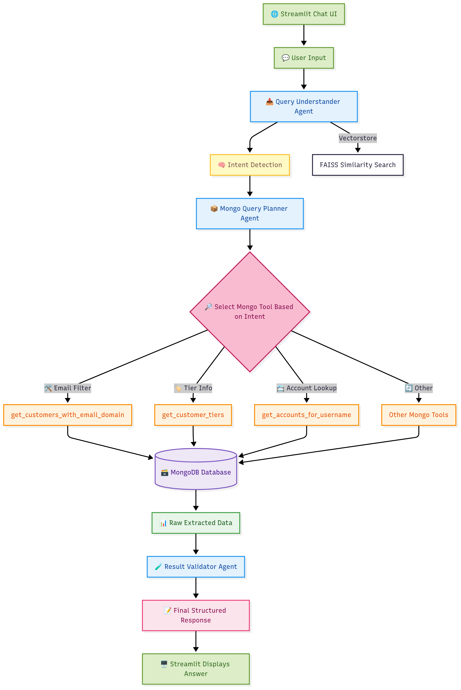

# 🧠 Conversational DB Agent

Chat with your **MongoDB** database using **natural language queries**! 

    - This AI-powered agent understands user queries from natural language

    - Convert user queries into MongoDB queries to extract requiered data from database

    - Use Agenetic Reasoning to returns insightful results.

    - Loom Videos to show working model: 
            1.https://www.loom.com/share/a3fae6c6d67a4346b8a15d4b1b5a0633?sid=62697a53-819a-4e3f-8d93-b6d104d5bf33
            2.https://www.loom.com/share/ae4291976e5e42c7978908b7ef3be8d3?sid=e57197a6-d41c-419b-ace0-b6903830feaf

---

## 🚀 Features

- 💬 Natural language chat interface via `Streamlit`
- 🧠 Agentic reasoning using `CrewAI` with modular agent roles:
  - **Query Understander**
  - **Mongo Query Planner**
  - **Result Validator**
- 🔍 Intent matching using `FAISS` and `HuggingFace Embeddings`
- 🔌 Connects to MongoDB `sample_analytics` dataset (accounts, transactions, customers)
- 🛠️ Custom tools for database operations
- 📚 Uses `sample_questions.json` for few-shot intent examples
- 🔄 Handles multi-step reasoning via CrewAI
- ❌ Graceful error handling for unknown or ambiguous inputs


## ⚙️ Setup Instructions

### 1. Clone the Repository

```bash
git clone https://github.com/your-username/conversational-db-agent.git
cd conversational-db-agent
```

### 2. Install Dependencies

We recommend using a virtual environment:

```bash
python -m venv venv
source venv/bin/activate  # or venv\Scripts\activate on Windows

pip install -r requirements.txt
```

### 3. Configure Environment Variables

Create a `.env` file in the root directory:

```bash
MONGODB_URI="your-mongodb-uri"
GEMINI_API_KEY="your-generative-ai-key"
HF_TOKEN="YOUR-HUGGINGFACE-api-key"
```

### 4. Run the App

```bash
streamlit run app.py
```

The app will open in your browser at `http://localhost:8501`.

---
# 🧠 Conversational Database Agent - Architecture

- The system allows users to chat with MongoDB database using natural language, powered by CrewAI Agents, HuggingFace Embeddings, Google Generative AI Chat Model, and Streamlit for an interactive UI.

---

## 📌 High-Level Overview


---

## 🧱 Components

### 1. Streamlit Frontend (`app.py`)
- Provides a chat-based user interface.
- Displays both user queries and agent responses.
- Handles session management and chat history.

### 2. CrewAI Agents (`main.py`)
- Central logic for handling natural language input.
- Uses custom `CrewAI Tools` and `memory` for interactive querying.
- Integrates a custom toolset for MongoDB operations.

### 3. Tools
Functions registered with the CrewAI Agents to perform specific DB operations:
- `get_customer_tiers`
- `get_customers_with_email_domain`
- `get_accounts_for_username`
- And many more defined in `main.py`.

### 4. FAISS Vectorstore
- Performs similarity search to identify user intent.
- Matches user input with stored intents from `sample_questions.json`.

### 5. MongoDB Database
- Primary data source (MongoDB Atlas or local).
- Collections: `customers`, `accounts`, `transactions`.
- Link for dataset - https://www.mongodb.com/docs/atlas/sample-data/sample-analytics/

---
## 🔁 Data Flow
<div style="text-align: center;">
    
</div>

1. **User enters natural language query in Streamlit chat.**
2. **app.py** sends the query to the first agent (`Query Understander Agent`).
3. **Data would flow into these agents sequentially :**

    **(Multi Agent Architecture)**
### 1️⃣ Query Understander Agent

- **Goal**: Understand what the user wants.
- **Uses**:
  - Tools for semantic parsing
  - `FAISS` similarity search on `sample_questions.json`
- **Output**: Refined user intent or rephrased task for the next agent

---

### 2️⃣ Mongo Query Planner Agent

- **Goal**: Translate intent into MongoDB-compatible queries.
- **Uses**:
  - Tools like `get_transactions_by_amount`, `get_customers_by_email`, etc.
  - Executes actual database queries via `pymongo`
- **Output**: Extracted raw data from the MongoDB collections

---

### 3️⃣ Result Validator Agent

- **Goal**: Validate and interpret raw data based on the original user question.
- **Uses**:
  - Access to both raw data and initial user query
  - Language modeling to structure a meaningful natural language response
- **Output**: Final structured answer sent back to the frontend

4. **Response** is returned from Agent → Streamlit.
5. **User sees the assistant's response** in the chat.

---

## 🧠 Technologies Used

| Component            | Technology              |
|---------------------|-------------------------|
| UI                  | Streamlit               |
| LLM Integration     | CrewAI + GEMINI LLM|
| Vector Database     | FAISS  + HuggingFace Embeddings                |
| Backend Logic       | Python + CrewAI Tools and Tasks|
| Database            | MongoDB (via PyMongo)   |

---

## 🗂 Directory Structure

```
├── app.py                      # Streamlit frontend app
├── main.py                     # Core agent logic and tools
├── .env                        # API KEYS
├── utils/vector_store.py       # # FAISS intent matching logic
├── requirements.txt            # Python dependencies
├── sample_questions.json       # Pre-defined sample questions for few shot learning
├── README.md                   # Project documentation (you are here)
```

---

## 🔐 Environment Variables

Stored in a `.env` file:

- MONGODB_URI=your_mongodb_connection_string
- GEMINI_API_KEY=your_google_genai_api_key
- HF_TOKEN=your-huggingface-api-key

---

## 💡 Sample Questions

Sample questions are loaded from `sample_questions.json` to help agent to analyze different types of user’s  query intent. Examples:

- "Show me transactions greater than 1000 for account 328304."
- "List customer tiers and their benefits."
- "Retrieve all customers with 'xyz@gmail.com' email."

---
